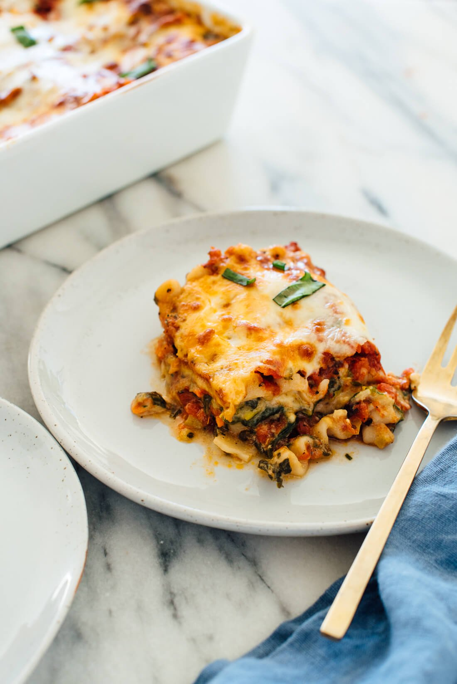

# Best Vegetable Lasagna

- Veggies and spinach
  - 2 tablespoons extra-virgin olive oil
  - 3 large carrots, chopped (about 1 cup)
  - 1 red bell pepper, chopped
  - 1 medium zucchini, chopped
  - 1 medium yellow onion, chopped
  - ¼ teaspoon salt
  - 5 to 6 ounces baby spinach
- Tomato sauce (or substitute 2 cups prepared marinara sauce)
  - 1 large can (28 ounces) diced tomatoes
  - ¼ cup roughly chopped fresh basil + additional for garnish
  - 2 tablespoons extra-virgin olive oil
  - 2 cloves garlic, pressed or minced
  - ½ teaspoon salt
- Remaining Ingredients
  - 2 cups (16 ounces / ½ a package) low-fat cottage cheese, divided
  - ¼ teaspoon salt, to taste
  - Freshly ground black pepper, to taste
  - 9 no-boil lasagna noodles, preferably whole wheat
  - 8 ounces (2 cups) freshly grated low-moisture, part-skim mozzarella cheese

1. Preheat the oven to 425 degrees Fahrenheit.
2. To prepare the veggies: In a large skillet over medium heat, warm the olive oil over medium heat. Once shimmering, add the carrots, bell pepper, zucchini, yellow onion, and salt. Cook, stirring every couple of minutes, until the veggies are golden on the edges, about 8 to 12 minutes.
3. Add a few large handfuls of spinach. Cook, stirring frequently, until the spinach has wilted. Repeat with remaining spinach and cook until all of the spinach has wilted, about 3 minutes. Remove the skillet from the heat and set aside.
4. Meanwhile, to prepare the tomato sauce: Pour the tomatoes into a mesh sieve or fine colander and drain off the excess juice for a minute. Then, transfer the drained tomatoes to the bowl of a food processor. Add the basil, olive oil, garlic, and salt.
5. Pulse the mixture about 10 times, until the tomatoes have broken down to an easily spreadable consistency. Pour the mixture into a bowl for later (you should have a little over 2 cups sauce). Rinse out the food processor and return it to the machine.
6. Pour half of the cottage cheese (1 cup) into the processor and blend it until smooth, about 1 minute. Transfer the mixture to large mixing bowl. No need to rinse out the bowl of the food processor this time; just put it back onto the machine because you’ll need it later.
7. Transfer the cooked veggies and spinach mixture to the bowl of the food processor. Pulse until they are more finely chopped (but not puréed!), about 5 to 7 times, stopping to scrape down the sides as necessary. Transfer the mixture to the bowl of whipped cottage cheese. Top with the remaining cottage cheese, then add 1/4 to 1/2 teaspoon salt (to taste) and lots of freshly ground black pepper. Stir to combine. Now it’s lasagna assembly time!
8. Spread 1⁄2 cup tomato sauce evenly over the bottom of a 9” by 9” baking dish. Layer 3 lasagna noodles on top (snap off their ends to fit, and/or overlap their edges as necessary). Spread half of the cottage cheese mixture evenly over the noodles. Top with 3/4 cup tomato sauce, then sprinkle 1⁄2 cup shredded cheese on top.
9. Top with 3 more noodles, followed by the remaining cottage cheese mixture (we’re skipping the tomato sauce in this layer.) Sprinkle 1⁄2 cup shredded cheese on top.
10. Top with 3 more noodles, then spread 3/4 cup tomato sauce over the top (you may have a little sauce leftover) to evenly cover the noodles. Sprinkle evenly with 1 cup shredded cheese.
11. Wrap a sheet of parchment paper around the top of the lasagna (or cover the lasagna with aluminum foil, but don’t let the foil touch the cheese). Bake, covered, for 18 minutes, then remove the cover, rotate the pan by 180° and continue cooking for about 10 to 12 more minutes, until the top is turning spotty brown.
12. Remove from oven and let the lasagna cool for 15 to 20 minutes, so it has time to set and cool down to a reasonable temperature. Sprinkle additional basil over the top, then slice and serve.
