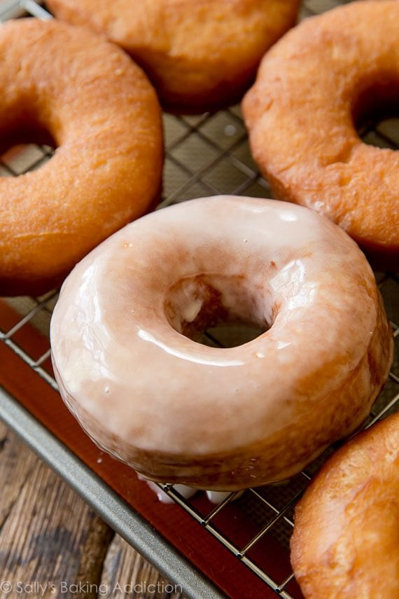

# Glazed Doughnuts

- 1 cup (240ml) whole milk, warmed to about 110°F*
- 1 Tablespoon active dry yeast*
- 1/4 cup (50g) granulated sugar
- 2 large eggs
- 6 Tablespoons (86g) butter, melted and slightly cooled
- 1 teaspoon pure vanilla extract
- 4 cups (490g) all-purpose flour (spoon &amp; leveled), plus more as needed
- 1/2 teaspoon salt
- 1/4 teaspoon ground nutmeg
- 1 – 2 quarts oil*
- 2 cups (240g) confectioners&#39; sugar, sifted
- 1/3 cup (80ml) heavy cream or whole milk (I prefer cream)
- 1/2 teaspoon pure vanilla extract

1. Pour the warm milk into the bowl of a stand mixer fitted with a dough hook attachment. Or, if you do not own a stand mixer, a regular large mixing bowl. Sprinkle yeast and 1/2 teaspoon of the sugar on top of the milk. Give it a light stir with a spoon and allow to sit for 5 minutes. The mixture should be frothy after 5 minutes. If not, start over with new yeast.
2. If you do not have a mixer, you can mix by hand in this step. With the stand mixer running on low speed, add the remaining sugar, eggs, butter, vanilla, 2 cups of flour, salt, and nutmeg. Beat on low speed for 1 minute or until combined.
3. Add remaining flour and beat on medium-high speed until the dough begins to pull away from the sides of the bowl. The dough should be thick, yet soft. And slightly sticky. If it is too wet, add 2-3 more Tablespoons of flour. Make sure you do not add too much extra flour; you want a soft, slightly sticky dough.
4. Form dough into a ball and turn it out onto a lightly floured surface. Knead for 2 minutes, then place into a greased bowl– I usually just use oil or nonstick spray. Turn the dough over to coat all sides. Cover the bowl with plastic wrap and place it in a warm environment to rise until doubled, about 1 and 1/2 hours. For this warm environment, I preheat the oven to 200°F (93°C) then turn the oven off and place the bowl inside the warm-ish oven.
5. Once doubled in size, punch down the dough to release any air bubbles.
6. Remove dough from the bowl and turn it out onto a lightly floured surface. Punch down again to release any more air bubbles if needed.
7. Roll the dough out until it is only 1/2 inch thick. Using a doughnut cutter, cut into 12 doughnuts. If you can’t quite fit 12, re-roll the scraps and cut more.
8. Line 2 baking sheets with parchment paper or silicone baking mats.
9. Place 6 doughnut and doughnut holes on each. Cover with kitchen towels and allow to rest for about 15-20 minutes as you prepare the oil. 
10. Place a cooling rack over a third baking sheet.
11. Pour oil into the pot set over medium heat.
12. Heat to 375°F (191°C).
13. Add 2-3 doughnuts at a time and cook for 1 minute on each side. Carefully remove with a metal spatula or metal slotted spoon. Wear kitchen gloves if oil is splashing.
14. Place onto prepared rack. Repeat with remaining doughnuts, then turn off heat.* (See note for doughnut holes.)
